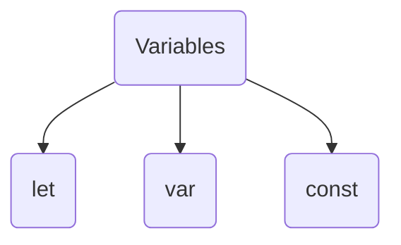
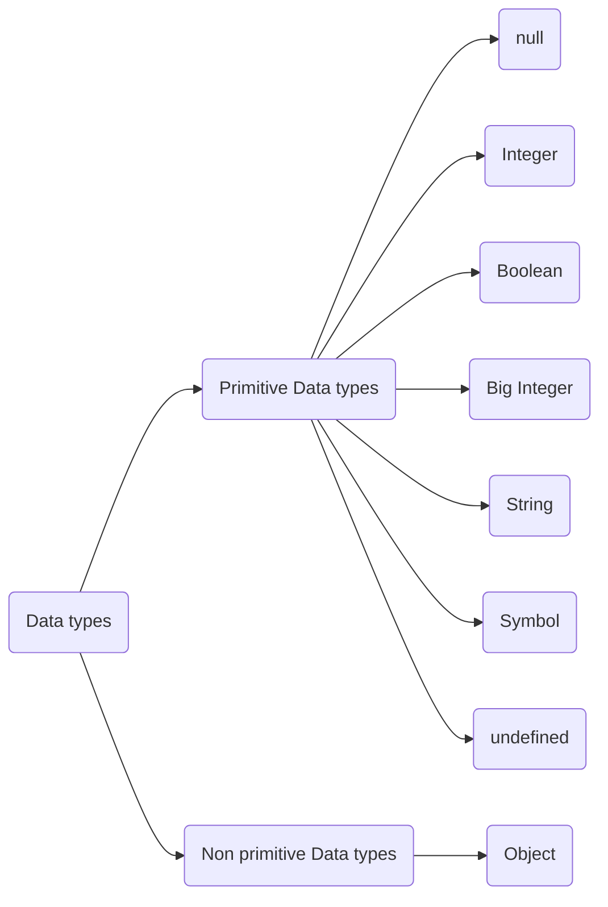

<!-- Heading -->
# Learn Javascript

<!-- Inline Code Block -->
<p> This Repository is based on basic javascript concept and its implementation.  </p>

<!-- Strong -->
**Author: Kalpa Behera**

<!-- Italics -->
*Date:03/01/2024*

<!-- Horizontal Rule -->

---

If you are feeling generous, buy me a coffee - [www.buymeacoffee.com](https://www.buymeacoffee.com/DRKRB "buymeacoffee")


[](https://www.buymeacoffee.com/drkrb)

---
* Learn Basic Javascript
* Arithmetic Operation Javascript


<!-- Blockquote -->

> Contents
> - [Topics](#topics)
> - [Find a bug?](#find-a-bug)

### Topics: 

<!-- OL-->
1. String
    1. anchor()
    2. at()
    3. big()
    4. blink()
    


1. DOM
1. Arithmetic Operation
    * Addition
    * Subtraction

<!-- UL -->

<!-- Start of Variables -->
##### Variables
---



```js
let a = 67
console.log(a);

a = "Mahadev"
console.log(a);

const author = "Shiva"
console.log(author);
```
> Outputs:  
> * 67
> * Mahadev
> * Shiva

---

<!-- End of Variables -->

<!-- Start of data types-->
#### Data types
---


```js
let a = null;
let b = 345;
let c = true;
let d = BigInt("345") + BigInt("7");
let e = "Sambhu";
let f = Symbol("Har Har Mahadev");
let g = undefined;

console.log(a, b, c, d, e, f);

console.log(typeof(a));
console.log(typeof(b));
console.log(typeof(c));
console.log(typeof(d));
console.log(typeof(e));
console.log(typeof(f));
console.log(typeof(g));
```
> Output
> * null 345 true 352n Sambhu Symbol(Har Har Mahadev)
> * object
> * number
> * boolean
> * bigint
> * string
> * symbol
> * undefined
---
<!-- End of data types-->
<!-- Links -->

[Youtube](https://www.youtube.com "Youtube")


<!-- Tables -->
| Name | E-mail |
| :---  |:---|
|Kalpa Behera | krbehera92@gmail.com|

<!-- Task Lists -->

* [x] Task 1

<details>
    <summary>Details</summary>
    Details can be seen here
</details>

### Find a bug?
If you found a issue or would like to submit an improvement to this project, Please submit an issue using issue tab above.

### Like this project?
<!-- Link -->
If you are feeling generous, buy me a coffee - [www.buymeacoffee.com](https://www.buymeacoffee.com/DRKRB "buymeacoffee")

<!-- Images -->


