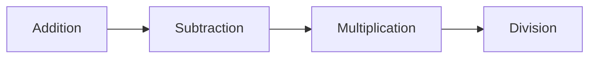

<!-- Heading -->
# Learn Javascript

<!-- Inline Code Block -->
<p> This Repository is based on basic javascript concept and its implementation.  </p>

<!-- Strong -->
**Author: Kalpa Behera**

<!-- Italics -->
*Date:03/01/2024*

<!-- Horizontal Rule -->

---

If you are feeling generous, buy me a coffee - [www.buymeacoffee.com](https://www.buymeacoffee.com/DRKRB "buymeacoffee")


[](https://www.buymeacoffee.com/drkrb)

---
* Learn Basic Javascript
* Arithmetic Operation Javascript


<!-- Blockquote -->

> Contents
> - [Find a bug?](#find-a-bug)

> Topics: 

<!-- OL-->
1. String
    1. anchor()
    2. at()
    3. big()
    4. blink()
    

1. DOM
1. Arithmetic Operation
    * Addition
    * Subtraction

<!-- UL -->
* 

<!-- Mermaid -->



<!-- Links -->

[Youtube](https://www.youtube.com "Youtube")

<!-- Github Markdown -->
<!-- Code Blocks -->
```bash
    npm install
```


<!-- Tables -->
| Name | E-mail |
| :---  |:---|
|Kalpa Behera | krbehera92@gmail.com|

<!-- Task Lists -->

* [x] Task 1

<details>
    <summary>Details</summary>
    Details can be seen here
</details>

### Find a bug?
If you found a issue or would like to submit an improvement to this project, Please submit an issue using issue tab above.

### Like this project?
<!-- Link -->
If you are feeling generous, buy me a coffee - [www.buymeacoffee.com](https://www.buymeacoffee.com/DRKRB "buymeacoffee")

<!-- Images -->


