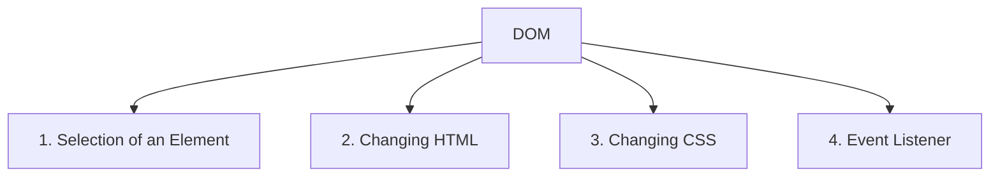
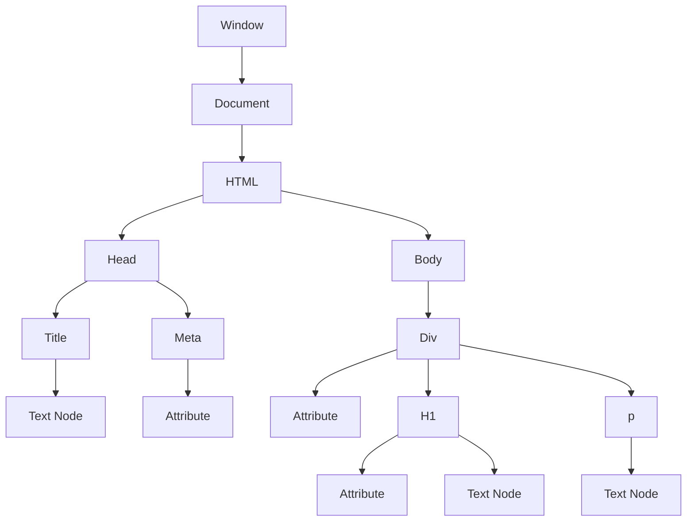
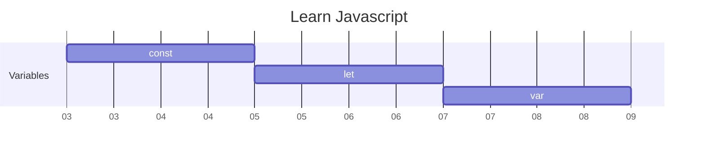

<!-- Heading -->
# Learn Javascript

<!-- Inline Code Block -->
<p> This Repository is based on basic javascript concept and its implementation.  </p>

<!-- Strong -->
**Author: Kalpa Behera**

<!-- Italics -->
*Date:03/01/2024*

<!-- Horizontal Rule -->

---

If you are feeling generous, buy me a coffee - [www.buymeacoffee.com](https://www.buymeacoffee.com/DRKRB "buymeacoffee")

                    OR

[]

---
* Learn Basic Javascript
* Arithmetic Operation Javascript


<!-- Blockquote -->

> Contents
1. [Topics](#topics)
2. [Variables](#variables)
3. [Data Types](#data-types)
   1. [Primitive Data Type](#primitive-data-types) 
   2. [Non Primitive Data Type](#non-primitive-data-types)
   3. [Operator](#operator)
      1. 
4. [Find a bug?](#find-a-bug)

## Topics: 

<!-- OL-->
1. String
    1. anchor()
    2. at()
    3. big()
    4. blink()
    


2. DOM
3. Arithmetic Operation
    * Addition
    * Subtraction
4. Objects
5. Events
6. 

---
<!-- Start of Variables -->
## Variables
---


```js
let a = 67
console.log(a);

a = "Mahadev"
console.log(a);

const author = "Shiva"
console.log(author);
```
> Outputs:  
> * 67
> * Mahadev
> * Shiva

---

<!-- End of Variables -->

<!-- Start of data types-->
## Data types
---

### Primitive Data types

```js
let a = null;
let b = 345;
let c = true;
let d = BigInt("345") + BigInt("7");
let e = "Sambhu";
let f = Symbol("Har Har Mahadev");
let g = undefined;

console.log(a, b, c, d, e, f);

console.log(typeof(a));
console.log(typeof(b));
console.log(typeof(c));
console.log(typeof(d));
console.log(typeof(e));
console.log(typeof(f));
console.log(typeof(g));
```
> Output
> * null 345 true 352n Sambhu Symbol(Har Har Mahadev)
> * object
> * number
> * boolean
> * bigint
> * string
> * symbol
> * undefined

### Non Primitive Data types

```js
const item = {
    "Nataraj" : true,
    "Nilakantha" : false,
    "Adiyogi" : 67,
    "Bhairav" : undefined
}

console.log(item.Adiyogi, item.Bhairav, item.Nataraj);
```
> Output
> * 67 
> * undefined 
> * true
---
<!-- End of data types-->

<!-- Start of Operators -->
### Operator
---

#### Arithmetic Operator
```js
let Op_a = 43;
let Op_b = 3;
```
##### Addition(+)
```js
console.log("Addition of two numbers is : ",Op_a + Op_b);
```
> Output
> * Addition of two numbers is :  46
##### Subtraction(-)
```js
console.log("Subtraction of two numbers is : ",Op_a - Op_b);
```
> Output
> * Subtraction of two numbers is :  40
##### Multiplication(*)
```js
console.log("Multiplication of two numbers is : ",Op_a * Op_b);
```
> Output
> * Multiplication of two numbers is :  129
##### Division(/)
```js
console.log("Division of two numbers is : ",Op_a / Op_b);
```
> Output
> * Division of two numbers is :  14.333333333333334
##### Exponential(**)
```js
console.log("Exponential of two numbers is : ",Op_a ** Op_b);
```
> Output
> * Exponential of two numbers is :  79507
##### Modulo(%)
```js
console.log("Mudulo of two numbers is : ",Op_a % Op_b);
```
> Output
> * Mudulo of two numbers is :  1
##### Incremental(++)
```js
Op_a++;
console.log("Incremental of Op_a ", Op_a);
```
> Output
> * Incremental of Op_a  44
##### Decremental(--)
```js
Op_a--;
console.log("Decremental of Op_a ", Op_a);
```
> Output
> * Decremental of Op_a  43
#### Assignment Operator
##### Equal(=)
```js
let AOa1 = 5;
console.log(AOa1);
```
##### Plus Equal to(+=)
```js
AOa1 += 4;
console.log(AOa1);
```
##### Minus Equal to(-=)
```js
AOa1 -= 1;
console.log(AOa1);
```
##### Multiplication Equal to(*=)
```js
AOa1 *= 2;
console.log(AOa1);
```
##### Division Equal to(/=)
```js
AOa1 /= 2;
console.log(AOa1);
```
##### Modulo Equal to(%=)
```js
AOa1 %= 3;
console.log(AOa1);
```
##### Exponential Equal to(**=)
```js
AOa1 **= 2;
console.log(AOa1);
```
#### Comparision Operator
```js
let Comp1 = 30;
let Comp2 = 40;
```
##### Equal to(==)
```js
console.log("Return the value of Comp1 == Comp2: ", Comp1 == Comp2);
```
##### Not Equal to(!=)
```js
console.log("Return the value of Comp1 != Comp2: ", Comp1 != Comp2);
```
##### Equal value and type(===)
```js
console.log("Return the value of Comp1 === Comp2: ", Comp1 === Comp2);
```
##### Not equal value or not equal type(!==)
```js
console.log("Return the value of Comp1 !== Comp2: ", Comp1 !== Comp2);
```
##### Greater than(>)
```js
console.log("Return the value of Comp1 > Comp2: ", Comp1 > Comp2);
```
##### Less than(<)
```js
console.log("Return the value of Comp1 < Comp2: ", Comp1 < Comp2);
```
##### Greater than or equal to(>=)
```js
console.log("Return the value of Comp1 >= Comp2: ", Comp1 >= Comp2);
```
##### Less than or equal to(<=)
```js
console.log("Return the value of Comp1 <= Comp2: ", Comp1 <= Comp2);
```
##### Ternary Operator(?)

#### Logical Operator
```js
let LOa1 = 100;
let LOa2 = 200;
```
##### Logical AND(&&)
```js
console.log("LOa1 > 20 && LOa2 < 300 :", LOa1 > 20 && LOa2 < 300);
```
##### Logical OR(||)
```js
console.log("LOa1 > 20 || LOa2 < 300 :", LOa1 > 20 || LOa2 < 300);
```
##### Logical NOT(!)
```js
console.log(!false);
console.log(!true);

```
<!-- End of Operators -->
<!-- Start of DOM(Document Object Model)-->
---
##### DOM(Document Object Model)
---


##### 1. Selection of an Element 
##### 2. Changing HTML
##### 3. Changing CSS
##### 4. Event Listener

```mermaid
gantt 
    title DOM (Document Object Model)
    dateFormat X
    axisFormat %M
    section DOM(Document Object Model)
        Selection of an Element: 10, 15
        Changing HTML: 10, 20
        Changing CSS: 20, 10
        Event Listener: 30, 40
```






<!-- End of DOM(Document Object Model)-->
<!-- Tables -->
| Name | E-mail |
| :---  |:---|
|Kalpa Behera | krbehera92@gmail.com|

<!-- Task Lists -->

* [x] Task 1

<details>
    <summary>Details</summary>
    Details can be seen here
</details>

### Find a bug?
If you found a issue or would like to submit an improvement to this project, Please submit an issue using issue tab above.

### Like this project?
<!-- Link -->
If you are feeling generous, buy me a coffee - [www.buymeacoffee.com](https://www.buymeacoffee.com/DRKRB "buymeacoffee")

<!-- Images -->



